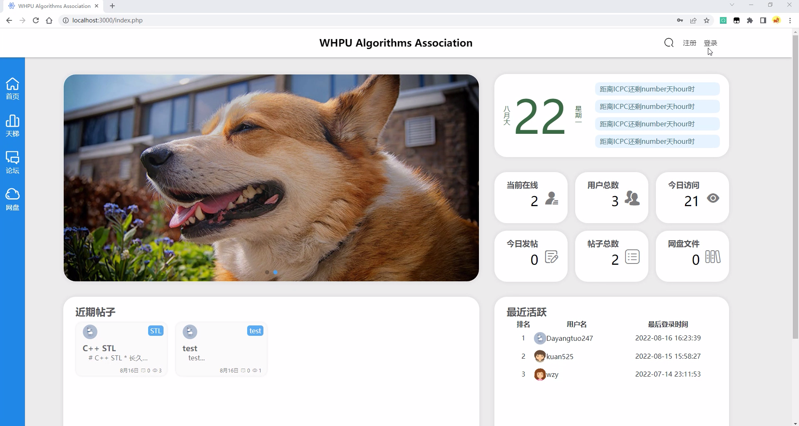

## 项目说明

该项目旨在构建武汉轻工大学算法协会天梯、论坛、网盘一体的网站，目前完成大部分功能，但仍有少部分功能尚未完成。演示如下

<a href="demo.mp4"></a>

## 环境要求

+ PHP >= 8.0
+ mysql 推荐 8.0（暂未测试最低版本）

demo运行环境：win11 + apache 2.4.53 + php 8.1.6 + mysql 8.0，使用XMAPP3.3.0构建


## 尚未完成功能

+ 用户信息展示界面
+ 用户个人信息编辑界面
+ 评论删除功能
+ 通知功能
+ 搜索功能
+ 网盘


## 构建

### 初始化

将项目git到本地

```
git clone https://github.com/DaYangtuo247/whpu-algorithmUnionWeb
```

### 构建数据库

由于本项目目前尚未实现install功能，因此在运行本项目之前，请先构建数据库，将buildDB中的三个文件依次倒入mysql，中，使你的数据有如[数据库结构](#数据库结构)所示结构，然后打开dbConfig.php配置本地数据库地址、账号、密码

```php
<?php
$config = array(
    'host' => 'localhost',
    'account' => 'root',
    'password' => "Wql247360"
);
return $config;
```

将algorithmUnionWeb文件夹下的所有文件拷贝到XAMPP安装目录的xampp/htdocs/目录下，在XAMPP中启动apache

### 启动心跳连接

在windows powersheel中输入如下命令，前提要求php环境变量存在且运行正常

```
E:\xampp\php\php.exe -f "E:\algorithmUnionWeb\control\heartbeat.php" -- -arg1 -arg2

心跳机制，前台js每隔5分钟发送一次消息，后端接受到消息后返回给前台是否连接成功的消息，依次来判断用户是否在线
```


## 网盘

对于网盘的构建，目前的方案如下，在该项目中尚未上传相关文件，如有需要，请联系

* filegator + 阿里云OSS ossfs挂载
    * 优点：不限制带宽，由用户网速所决定下载速度
    * 缺点：在ossfs不活跃时，首次访问过慢，需要等待5s左右
* filegator + 阿里云OSS FileSystem
    * 优点：filegator可以直接操纵oss，下载速度不限
    * 缺点：上传大文件会导致中断，目前尚未解决
* Directory Lister + ossfs
* filegator + 服务器空间
    * 优点：下载速度由服务器带宽决定，费用高
    * 缺点：空间由服务器大小决定


## 项目目录结构

```
├─banner                    //主页公告
├─control
│  ├─workerman
│  ├─connect.php            //连接数据库
│  ├─heartbeat.php          //心跳连接，检测是否登录状态
│  ├─like.php               //点赞
│  ├─login.php              //登录
│  ├─loginCheck.php         //登录检查
│  ├─quit.php               //退出登录
│  ├─register.php           //注册
│  ├─updHeadImg.php         //更新头像
│  ├─updRanking.php         //更新天梯榜单
│  └─workerman.log          //workerman日志
│  
├─error                     //报错页面
│  ├─assets
│  └─error.html
│
├─forum
│  ├─API                    //论坛API接口，包含添加评论、创建文章、更新文章图片、获取文章信息等
│  ├─articleImage           //文章内嵌图片存储
│  │  └─Dayangtuo247-1659720697
│  │      └─commentImg      //当前文章下的评论图片存储
│  ├─editormd               //editmr.md开源markdown编辑器
│  │  └─editormd.js         //编辑器控制及调用函数
│  │      
│  ├─reply-editor           //文章评论回复区域编辑器
│  │  ├─css
│  │  ├─img                 //评论回复表情
│  │  │  ├─emoji
│  │  │  ├─qq
│  │  │  └─tieba
│  │  └─script
│  ├─temp                   //创建包含图片的文章但尚未发布图片存储区域
│  ├─article.php            //文章主要界面
│  └─create-edit.php        //文章编辑器
│
├─script                    //项目公共函数
│   ├─coco-message.js	    //弹窗
│   ├─happyimage.min.js     //轮播图
│   ├─header.js			    //登录控件
│   ├─heartbeat.js		    //心跳检测
│   ├─moment.min.js		    //时间格式化库，于jquery类似
│   ├─moment-zh-cn.min.js	//中文补丁
│   ├─ranking.js 		    //天梯相关函数
│   ├─timeFormat.js		    //时间戳格式化
│   └─loginCheck.js		    //登录检查
│
├─style                     //项目样式
│  ├─css
│  ├─font
│  └─image
│
├─userinfo                  //用户信息相关
│  ├─userPictures           //用户头像，default为系统默认头像
│  │   └─default
│  └─userinfo.php           //用户个人信息界面
│
├─views                     //项目模板
│
├─could                     //网盘，目前尚未构建
│
├─forum.php                 //论坛首页
│
├─index.php                 //主页
│
└─ranking.php               //天梯首页
```

## 数据库结构

```
├─accout                //账号
│  ├─todaylike          //今日天梯点赞情况
│  └─user               //用户数据
│
├─forum                 //论坛
│  ├─article            //文章内容
│  ├─article-describe   //文章描述
│  ├─comment            //评论
│  ├─reply              //回复
│  └─tags               //文章标签
│
├─publicdata            //公共数据
│  ├─homepage           //主页信息
│  └─rankinglist        //天梯表
│
├─mysql
│
├─information_schema
│
├─performance_schema
│
└─sys
```


## 鸣谢

该项目的开发离不开以下开源项目，再次感谢

* [workerman](https://github.com/walkor/workerman)
* [Editor.md](https://github.com/pandao/editor.md)
* [coco-message](https://github.com/TheWindRises-2/coco-message)
* [jQuery-emoji](https://github.com/eshengsky/jQuery-emoji)


## 项目负责人

* [DaYangtuo247](https://github.com/DaYangtuo247?tab=repositories)
